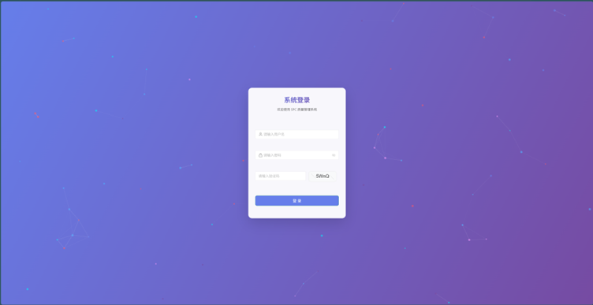
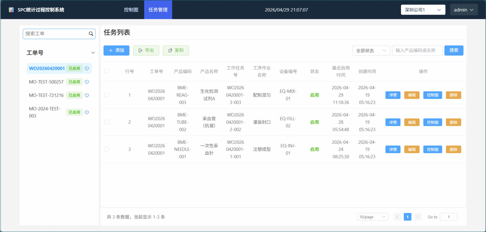
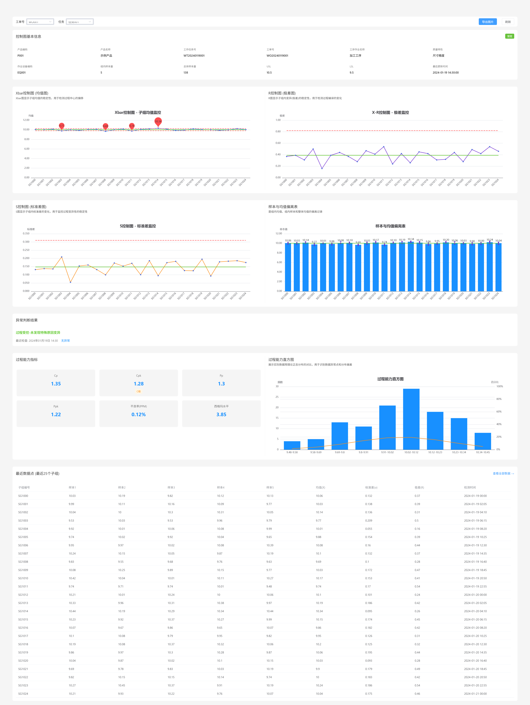

# SPC 质量管理系统

## 一、系统简介

### 1.1 系统概述

SPC（Statistical Process Control，统计过程控制）质量管理系统是一款面向制造业的质量监控与分析软件。该系统主要用于实时监控生产线过程中的产品质量，通过统计过程控制方法帮助企业及时发现生产异常，提高产品质量稳定性，降低不良品率。

系统采用 Vue 3 + Vite 前端框架开发，界面美观、操作便捷，支持工单管理、任务管理、SPC 控制图分析等功能模块，为质量管理人员提供全面的生产过程监控工具。

### 1.2 系统功能架构

```
┌─────────────────────────────────────────────────────────────┐
│                      SPC 质量管理系统                        │
├─────────────────────────────────────────────────────────────┤
│  ┌──────────┐   ┌──────────┐   ┌──────────┐   ┌──────────┐ │
│  │  系统登录 │   │ 工单管理  │   │ 任务管理  │   │ 控制图分析│ │
│  └──────────┘   └──────────┘   └──────────┘   └──────────┘ │
│       │              │              │              │         │
│       └──────────────┴──────────────┴──────────────┘         │
│                         │                                    │
│                    数据持久层                                │
│                  (Session/LocalStorage)                      │
└─────────────────────────────────────────────────────────────┘
```

### 1.3 技术栈

| 类别 | 技术 |
|------|------|
| 框架 | Vue 3 + Vite |
| 语言 | TypeScript |
| UI组件 | Element Plus、Naive UI |
| 状态管理 | Pinia |
| 路由 | Vue Router |
| 图表 | ECharts |
| 表格 | Element Plus Table |
| 数据导出 | xlsx、file-saver |
| 样式 | SCSS |

---

## 二、系统安装与运行

### 2.1 环境要求

| 环境项 | 要求版本 |
|--------|----------|
| Node.js | ^20.19.0 或 >=22.12.0 |
| npm | 9.0.0 或更高版本 |
| 浏览器 | Chrome/Edge/Firefox 最新版 |

### 2.2 安装步骤

```bash
# 1. 克隆或下载项目代码
git clone <项目仓库地址>
cd spc-client

# 2. 安装项目依赖
npm install
```

### 2.3 运行项目

```bash
# 开发模式运行（热重载）
npm run dev

# 生产环境构建
npm run build

# 生产环境预览
npm run preview

### 2.4 访问系统

开发服务器启动后，在浏览器中访问：`http://localhost:8080`
生产环境预览：`http://localhost:4173`

---

## 三、功能操作说明

### 3.1 系统登录

**功能描述**：用户通过输入用户名、密码和验证码进行身份验证，验证通过后进入系统。

**操作步骤**：

1. 打开系统登录页面
2. 在用户名输入框中输入用户名（默认测试账号：`admin`）
3. 在密码输入框中输入密码（默认测试密码：`123456`）
4. 在验证码输入框中输入图片显示的4位验证码
5. 点击「登录」按钮完成登录

**界面要素**：
- 用户名输入框：支持3-20位字符
- 密码输入框：支持6-20位字符，显示/隐藏密码
- 验证码输入框：4位字符，支持点击刷新
- 登录按钮：显示登录 loading 状态

### 3.2 工单管理

**功能描述**：管理生产工单，支持创建、编辑、删除、启用/禁用工单等操作。

**操作步骤**：

1. 登录系统后进入任务管理页面
2. 在左侧工单号列表中选择目标工单
3. 支持搜索特定工单号
4. 点击工单号可展开/折叠工单下的任务列表
5. 点击工单右侧的电源图标可启用/禁用该工单

**界面要素**：
- 工单号搜索框：支持按工单号模糊搜索
- 工单列表：显示所有工单号及状态
- 状态标签：显示「已启用」/「已关闭」状态
- 工单操作：启用/禁用工单

### 3.3 任务列表

**功能描述**：展示工单下的所有生产任务，支持任务的增删改查、筛选、导出等操作。

**操作步骤**：

1. 在任务列表页面查看所有任务数据
2. 使用顶部筛选器进行条件筛选：
   - 按任务状态筛选
   - 按产品编码或名称搜索
3. 点击「搜索」按钮应用筛选条件
4. 点击「添加」按钮创建新任务
5. 点击「导出」按钮导出任务数据到 Excel
6. 点击「复制」按钮复制选中任务数据

**表格列说明**：

| 列名 | 说明 |
|------|------|
| 行号 | 任务数据在列表中的序号 |
| 工单号 | 关联的生产工单编号 |
| 产品编码 | 产品的唯一识别码 |
| 产品名称 | 产品的名称 |
| 工作任务号 | 生产任务的唯一编号 |
| 工序作业名称 | 工序的具体作业名称 |
| 设备编号 | 生产使用的设备编号 |
| 状态 | 任务当前状态（已启用/已关闭） |
| 最近启用时间 | 任务最后一次启用的时间 |
| 创建时间 | 任务的创建时间 |

**操作按钮**：
- 详情：查看任务详细信息
- 编辑：修改任务内容
- 控制图：查看该任务的 SPC 控制图分析
- 删除：删除任务数据

### 3.4 控制图分析

**功能描述**：展示 SPC 统计控制图，包括 Xbar 控制图、R 控制图、S 控制图及样本偏离分析，帮助质量管理人员监控生产过程的稳定性。

**操作步骤**：

1. 在任务列表中点击「控制图」按钮进入控制图页面
2. 在顶部筛选器中选择工单号和任务进行数据筛选
3. 查看控制图基本信息卡片：
   - 产品编码/名称
   - 工作任务号/工单号
   - 工序作业名称/质量特性
   - 设备编码/样本量信息
   - USL（上限规格界限）/ LSL（下限规格界限）
4. 查看各类控制图：
   - **Xbar 控制图（均值图）**：显示子组均值的稳定性，用于检测过程中心的偏移
   - **R 控制图（极差图）**：显示子组内变异（极差）的稳定性，用于检测过程变异的变化
   - **S 控制图（标准差图）**：显示子组内标准差的变化，用于监控过程变异性的稳定性
   - **样本与均值偏离表**：显示组内均值、组内样本和整体均值的偏离记录
5. 点击「导出图片」按钮将控制图导出为图片文件
6. 点击「刷新」按钮重新加载数据

**控制图说明**：

SPC 控制图是统计过程控制的核心工具，通过绘制过程参数的中心线（CL）、控制上限（UCL）和控制下限（LCL），来判断过程是否处于统计受控状态。

- **中心线（CL）**：过程的平均值
- **控制上限（UCL）**：中心线上方3倍标准差
- **控制下限（LCL）**：中心线下方3倍标准差

### 3.5 数据导出

**功能描述**：支持将任务列表数据导出为 Excel 格式，便于离线分析和存档。

**操作步骤**：

1. 在任务列表页面点击「导出」按钮
2. 系统将当前筛选后的数据导出为 Excel 文件
3. 文件自动下载到本地

---

## 四、界面展示

### 4.1 登录页面



### 4.2 任务管理页面



### 4.3 控制图页面



---

## 五、测试账号

| 账号 | 密码 | 说明 |
|------|------|------|
| admin | 123456 | 管理员账号 |

---

## 六、常见问题

### 6.1 登录失败

**问题**：输入正确的账号密码仍然无法登录

**解决方案**：
1. 确认验证码输入正确
2. 检查网络连接是否正常
3. 清除浏览器缓存后重试

### 6.2 控制图不显示

**解决方案**：
1. 检查是否正确选择了工单号和任务
2. 点击「刷新」按钮重新加载数据
3. 检查浏览器控制台是否有报错信息

### 6.3 数据导出失败

**解决方案**：
1. 确认已安装必要的导出依赖
2. 检查浏览器是否拦截了文件下载
3. 尝试更换浏览器

---

## 七、系统维护

### 7.1 数据存储

- 用户登录信息：Session Storage
- 系统配置信息：Local Storage

### 7.2 安全性说明

- 密码在传输过程中进行加密处理
- 验证码机制防止暴力破解
- 路由守卫进行登录状态校验

---

## 八、技术支持

如有问题，请联系系统开发人员。

---

## 九、版本信息

| 版本 | 日期 | 说明 |
|------|------|------|
| v1.0.0 | 2026-04 | 初始版本 |

---

